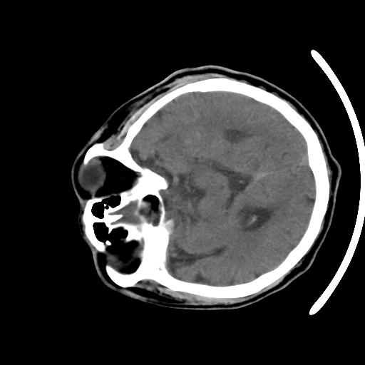
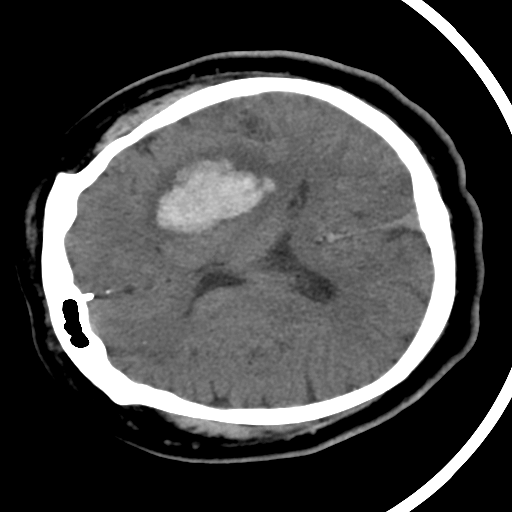

<h2>TensorFlow-FlexUNet-Image-Segmentation-Spontaneous-Intracerebral-Hemorrhage-CT (2025/10/21)</h2>

Toshiyuki Arai 
Software Laboratory antillia.com 
 
This is the first experiment of Image Segmentation for <b>PHE-SICH-CT-IDS-Hemorrhage-CT (Spontaneous Intracerebral Hemorrhage)</b> based on 
our <a href="./src/TensorFlowFlexUNet.py">TensorFlowFlexUNet</a>
 (<b>TensorFlow Flexible UNet Image Segmentation Model for Multiclass</b>)
, and a 512x512 pixels PNG dataset <a href="https://drive.google.com/file/d/1jowXif0M2Y3aFHOptUaG4Lg4VVdjfo_d/view?usp=sharing">
Augmented-PHE-SICH-CT-IDS-Hemorrhage-ImageMask-Dataset.zip</a>, which was derived by us from 
  
<b>SubdatasetC_PNG</b> of  
<a href="https://www.kaggle.com/datasets/naumanalimurad/phe-sich-ct-ids"><b>PHE-SICH-CT-IDS: Hemorrhage CT Scan Dataset</b></a>
 
Please see also <a href="https://en.wikipedia.org/wiki/Intracerebral_hemorrhage">Intracerebral hemorrhage</a>.
 
 
As demonstrated in <a href="https://github.com/sarah-antillia/TensorFlow-FlexUNet-Image-Segmentation-STARE-Retinal-Vessel">
TensorFlow-FlexUNet-Image-Segmentation-STARE-Retinal-Vessel</a>,
 our Multiclass TensorFlowFlexUNet, which uses categorized masks, can also be applied to 
single-class image segmentation models. 
This is because it inherently treats the background as one category and your single-class mask data as 
a second category. In essence, your single-class segmentation model will operate with two categorized classes within our Multiclass UNet framework.
  
<b>Data Augmentation Strategy</b> 
To address the limited size of PNG subset of <b>PHE-ICH-CT-IDS: Hemorrhage CT Scan Dataset</b> 
, we used our offline augmentation tool 
 <a href="https://github.com/sarah-antillia/Image-Distortion-Tool">
Image-Distortion-Tool</a> to augment the original subset.
 
 

<b>Actual Image Segmentation for Images of 512x512 pixels</b> 
As shown below, the inferred masks predicted by our segmentation model trained on the 
PNG dataset appear similar to the ground truth masks. 
 
<table>
<tr>
<th>Input: image</th>
<th>Mask (ground_truth)</th>
<th>Prediction: inferred_mask</th>
</tr>
<tr>
<td></td>
<td></td>
<td></td>
</tr>
</tr>
<td></td>
<td></td>
<td></td>
</tr>
<tr>
<td></td>
<td></td>
<td></td>
</tr>
</table>

 
<h3>1 Dataset Citation</h3>
The dataset used here was obtained from 
  
<a href="https://www.kaggle.com/datasets/naumanalimurad/phe-sich-ct-ids"><b>PHE-SICH-CT-IDS: Hemorrhage CT Scan Dataset</b></a>
 on the kaggle web-site.
  
<b>About Dataset</b> 
This publicly available dataset namely PHE-SICH-CT-IDS, which is constructed 120 CT scans of patients with 
spontaneous intracerebral hemorrhage. PHE-SICH-CT-IDS contains 3,511 CT images of SICH occurring in 
the basal ganglia region, with associated labels for the surrounding edematous zone around the hematoma. 
PHE-SICH-CT-IDS provides multiple functionalities including segmentation, detection, feature extraction, 
and more. It is divided into three sub-datasets representing different functionalities and formats: 
subdatasetA in NIfTI format, containing source CT data and edema zone labels, offering segmentation, 
feature extraction and prognosis prediction functionalities; subdatasetB and subdatasetC in JPG and PNG formats,
 containing sliced data with segmentation labels and detection annotations, providing segmentation and detection functionalities.

  
<b>LICENSE</b> 
<a href="https://creativecommons.org/licenses/by-sa/4.0/">CC BY-SA 4.0</a>
 
 
<h3>
2 PHE-SICH-CT-IDS ImageMask Dataset
</h3>
If you would like to train this PHE-SICH-CT-IDS Segmentation model by yourself,
 please download our data <a href="https://drive.google.com/file/d/1jowXif0M2Y3aFHOptUaG4Lg4VVdjfo_d/view?usp=sharing">
Augmented-PHE-SICH-CT-IDS-Hemorrhage-ImageMask-Dataset.zip
 </a> on the google drive,
, expand the downloaded, and put it under dataset folder to be:
<pre>
./dataset
└─PHE-SICH-CT-IDS
    ├─test
    │   ├─images
    │   └─masks
    ├─train
    │   ├─images
    │   └─masks
    └─valid
        ├─images
        └─masks
</pre>
<b>PHE-SICH-CT-IDS Statistics</b> 
 
 
As shown above, the number of images of train and valid datasets is large enough to use for a training set of our segmentation model.
  
 
<b>Train_images_sample</b> 

 
<b>Train_masks_sample</b> 

 
 
<h3>
3 Train TensorFlowUNet Model
</h3>
 We trained PHE-SICH-CT-IDS TensorFlowFlexUNet Model by using the following
<a href="./projects/TensorFlowFlexUNet/PHE-SICH-CT-IDS/train_eval_infer.config"> <b>train_eval_infer.config</b></a> file.  
Please move to ./projects/TensorFlowFlexUNet/PHE-SICH-CT-IDS and, and run the following bat file. 
<pre>
>1.train.bat
</pre>
, which simply runs the following command. 
<pre>
>python ../../../src/TensorFlowFlexUNetTrainer.py ./train_eval_infer.config
</pre>

<b>Model parameters</b> 
Defined a small <b>base_filters = 16</b> and large <b>base_kernels = (9,9)</b> for the first Conv Layer of Encoder Block of 
<a href="./src/TensorFlowFlexUNet.py">TensorFlowFlexUNet.py</a> 
and a large num_layers (including a bridge between Encoder and Decoder Blocks).
<pre>
[model]
image_width    = 512
image_height   = 512
image_channels = 3

num_classes    = 2

base_filters   = 16
base_kernels   = (9,9)
num_layers     = 8
dropout_rate   = 0.03
dilation       = (1,1)

</pre>

<b>Learning rate</b> 
Defined a very small learning rate.  
<pre>
[model]
learning_rate  = 0.00007
</pre>

<b>Online augmentation</b> 
Disabled our online augmentation.  
<pre>
[model]
model         = "TensorFlowFlexUNet"
generator     = False
</pre>

<b>Loss and metrics functions</b> 
Specified "categorical_crossentropy" and <a href="./src/dice_coef_multiclass.py">"dice_coef_multiclass"</a>. 
You may specify other loss and metrics function names. 
<pre>
[model]
loss           = "categorical_crossentropy"
metrics        = ["dice_coef_multiclass"]
</pre>
<b>Learning rate reducer callback</b> 
Enabled learing_rate_reducer callback, and a small reducer_patience.
<pre> 
[train]
learning_rate_reducer = True
reducer_factor     = 0.5
reducer_patience   = 4
</pre>

<b>Early stopping callback</b> 
Enabled early stopping callback with patience parameter.
<pre>
[train]
patience      = 10
</pre>

<b>RGB Color map</b> 
rgb color map dict for PHE-SICH-CT-IDS 1+1 classes.
<pre>
[mask]
mask_datatype    = "categorized"
mask_file_format = ".png"

; PHE-SICH-CT-IDS
; rgb color map dict for 2 classes.
;                 Hemorrhage:white
rgb_map = {(0,0,0):0,(255,255,255):1,}

</pre>

<b>Epoch change inference callback</b> 
Enabled <a href="./src/EpochChangeInferencer.py">epoch_change_infer callback (EpochChangeInferencer.py)</a></b>. 
<pre>
[train]
epoch_change_infer       = True
epoch_change_infer_dir   =  "./epoch_change_infer"
num_infer_images         = 6
</pre>

By using this callback, on every epoch_change, the inference procedure can be called
 for 6 images in <b>mini_test</b> folder. This will help you confirm how the predicted mask changes 
 at each epoch during your training process.    

<b>Epoch_change_inference output at starting (epoch 1,2,3)</b> 
 
 
<b>Epoch_change_inference output at middlepoint (epoch 29,30,31)</b> 
 
 

<b>Epoch_change_inference output at ending (epoch 60,61,62)</b> 
 
 

In this experiment, the training process was stopped at epoch 62 by EarlyStopping Callback.  
 
 

<a href="./projects/TensorFlowFlexUNet/PHE-SICH-CT-IDS/eval/train_metrics.csv">train_metrics.csv</a> 
 

 
<a href="./projects/TensorFlowFlexUNet/PHE-SICH-CT-IDS/eval/train_losses.csv">train_losses.csv</a> 
 
 

<h3>
4 Evaluation
</h3>
Please move to a <b>./projects/TensorFlowFlexUNet/PHE-SICH-CT-IDS</b> folder, 
and run the following bat file to evaluate TensorFlowUNet model for PHE-SICH-CT-IDS. 
<pre>
./2.evaluate.bat
</pre>
This bat file simply runs the following command.
<pre>
python ../../../src/TensorFlowFlexUNetEvaluator.py ./train_eval_infer.config
</pre>

Evaluation console output: 

  Image-Segmentation-PHE-SICH-CT-IDS

<a href="./projects/TensorFlowFlexUNet/PHE-SICH-CT-IDS/evaluation.csv">evaluation.csv</a> 

The loss (categorical_crossentropy) to this PHE-SICH-CT-IDS/test was very low, and dice_coef_multiclass very high as shown below.
 
<pre>
categorical_crossentropy,0.0027
dice_coef_multiclass,0.9986
</pre>
 
<h3>
5 Inference
</h3>
Please move to a <b>./projects/TensorFlowFlexUNet/PHE-SICH-CT-IDS</b> folder 
,and run the following bat file to infer segmentation regions for images by the Trained-TensorFlowUNet model for PHE-SICH-CT-IDS. 
<pre>
./3.infer.bat
</pre>
This simply runs the following command.
<pre>
python ../../../src/TensorFlowFlexUNetInferencer.py ./train_eval_infer.config
</pre>

<b>mini_test_images</b> 
 
<b>mini_test_mask(ground_truth)</b> 
 

<b>Inferred test masks</b> 
 
 
 

<b>Enlarged images and masks for Images of 512x512 pixels </b> 
<table>
<tr>

<th>Image</th>
<th>Mask (ground_truth)</th>
<th>Inferred-mask</th>
</tr>

<td></td>
<td></td>
<td></td>
</tr>
<tr>
<td></td>
<td></td>
<td></td>
</tr>
<tr>
<td></td>
<td></td>
<td></td>
</tr>
<tr>
<td></td>
<td></td>
<td></td>
</tr>
<tr>
<td></td>
<td></td>
<td></td>
</tr>
<tr>
<td></td>
<td></td>
<td></td>
</tr>

</table>

 

<h3>
References
</h3>
<b>1. Artificial Intelligence in Healthcare Competition (TEKNOFEST-2021):Stroke Data Set</b> 
Ural Koç,, Ebru Akçapınar Sezer, Yaşar Alper Özkaya, Yasin Yarbay4 , Onur Taydaş, 
Veysel Atilla Ayyıldız , Hüseyin Alper Kızıloğlu, Uğur Kesimal, İmran Çankaya, Muhammed Said Beşler, 
Emrah Karakaş, Fatih Karademir, Nihat Barış Sebik, Murat Bahadır , Özgür Sezer, 
Batuhan Yeşilyurt, Songul Varlı, Erhan Akdoğan, Mustafa Mahir Ülgü , Şuayip Birinci 

<a href="https://www.eajm.org/en/artificial-intelligence-in-healthcare-competition-teknofest-2021-stroke-data-set-1618971">
https://www.eajm.org/en/artificial-intelligence-in-healthcare-competition-teknofest-2021-stroke-data-set-1618971
</a>

  
<b>2. Hemorrhagic stroke lesion segmentation using a 3D U-Net with squeeze-and-excitation blocks</b> 
Valeriia Abramova, Albert Clèrigues, Ana Quiles, Deysi Garcia Figueredo, Yolanda Silva, Salvador Pedraza, 
 Arnau Oliver, Xavier Lladó 
<a href="https://www.sciencedirect.com/science/article/pii/S0895611121000574">
https://www.sciencedirect.com/science/article/pii/S0895611121000574
</a>
 
 
<b>3. Segmentation of acute stroke infarct core using image-level labels on CT-angiography</b> 
Luca Giancardo, Arash Niktabe, Laura Ocasio, Rania Abdelkhaleq, Sergio Salazar-Marioni, Sunil A Sheth 
<a href="https://pmc.ncbi.nlm.nih.gov/articles/PMC10011814/">
https://pmc.ncbi.nlm.nih.gov/articles/PMC10011814/
</a>
 
 
<b>4.Segmenting Small Stroke Lesions with Novel Labeling Strategies</b> 
Liang Shang, Zhengyang Lou, Andrew L. Alexander, Vivek Prabhakaran, 
William A. Sethares, Veena A. Nair, and Nagesh Adluru 
<a href="https://arxiv.org/pdf/2408.02929">
https://arxiv.org/pdf/2408.02929
</a>
 
 
<b>5. Spontaneous Intracerebral Hemorrhage</b> 
Kevin N. Sheth, M.D. 
<a href="https://www.nejm.org/doi/pdf/10.1056/NEJMra2201449">
https://www.nejm.org/doi/pdf/10.1056/NEJMra2201449
</a>
 
 
<b>6. Semantic Segmentation of Spontaneous Intracerebral Hemorrhage,  
Intraventricular Hemorrhage, and Associated Edema on CT Images Using Deep Learning</b> 
Yong En Kok, Stefan Pszczolkowski, Zhe Kang Law, Azlinawati Ali, Kailash Krishnan,  
Philip M Bath, Nikola Sprigg, Robert A Dineen, Andrew P French 
<a href="https://pmc.ncbi.nlm.nih.gov/articles/PMC9745441/">
https://pmc.ncbi.nlm.nih.gov/articles/PMC9745441/
</a>
 
 
<b>7. TensorFlow-FlexUNet-Image-Segmentation-Real-Time-Brain-Stroke-CT</b> 
Toshiyuki Arai antillia.com 
<a href="https://github.com/sarah-antillia/TensorFlow-FlexUNet-Image-Segmentation-Real-Time-Brain-Stroke-CT">
https://github.com/sarah-antillia/TensorFlow-FlexUNet-Image-Segmentation-Real-Time-Brain-Stroke-CT
</a>
 
 
<b>8. TensorFlow-FlexUNet-Image-Segmentation-TEKNOFEST-2021-Stroke-CT</b> 
Toshiyuki Arai antillia.com 
<a href="https://github.com/sarah-antillia/TensorFlow-FlexUNet-Image-Segmentation-TEKNOFEST-2021-Stroke-CT">
https://github.com/sarah-antillia/TensorFlow-FlexUNet-Image-Segmentation-TEKNOFEST-2021-Stroke-CT
</a>
 
 

